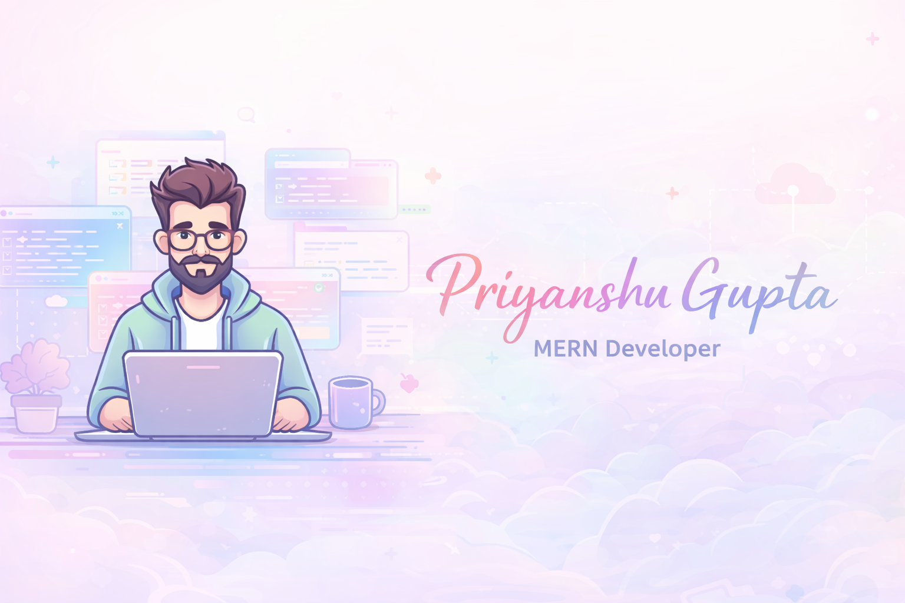

 

 

&nbsp;

&nbsp;

 

  

 

## 🌸 &nbsp; About Me

 

<table border="0" width="680">
<tr><td align="center">

 

*Hey there — I'm* ***Priyanshu***, *an aspiring full-stack developer*
*who genuinely loves building things for the web.*

*I believe great software isn't just functional — it's felt.*
*Clean architecture, thoughtful UX, and elegant logic*
*are what I strive for in every project I touch.*

 

| 🌿 | Building full-stack apps with **MERN Stack** |
|:---:|:---|
| 💡 | Turning ideas into seamless digital realities |
| 🎯 | Believer in writing code that speaks for itself |
| ☕ | Powered by curiosity and late-night coffee |

 

</td></tr>
</table>

 

  

  

## ✦ &nbsp; Tech Arsenal

 

  

&nbsp;
&nbsp;
&nbsp;
&nbsp;
&nbsp;
&nbsp;

  

---

## 🚀 &nbsp; Signature Project

 

<table border="0" width="620">
<tr>
<td align="center">
 

### ⚡ &nbsp; Real-Time Synchronization System

 

*A system that keeps multiple clients perfectly in sync*
*using WebSocket communication — engineered for*
*speed, reliability, and zero-latency state updates.*

 

&nbsp;
&nbsp;
&nbsp;
&nbsp;

 

 

</td>
</tr>
</table>

 

---

 

  

  

✦ &nbsp; Crafted with &nbsp;💜&nbsp; by &nbsp;<strong>PRIYANSHU GUPTA</strong> &nbsp;·&nbsp; 2025 &nbsp; ✦

  

